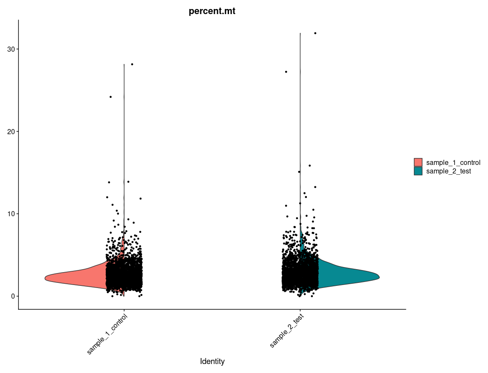
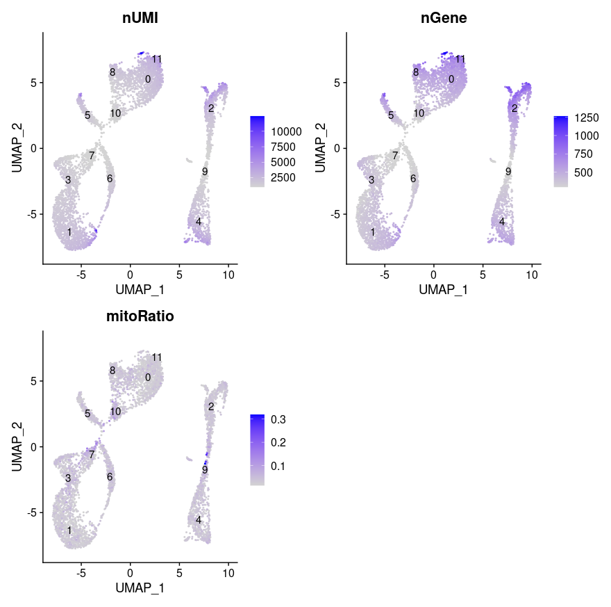
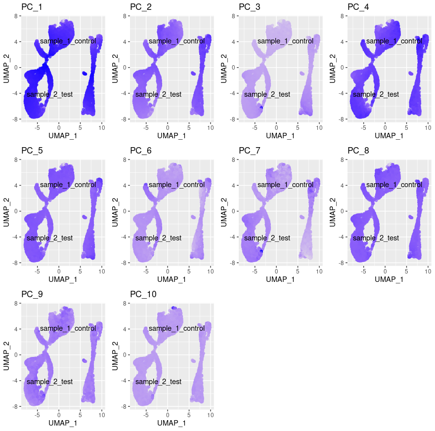
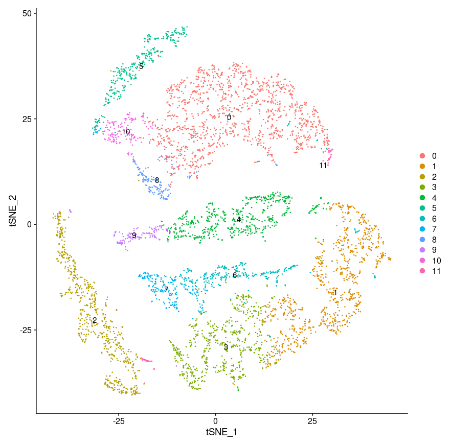
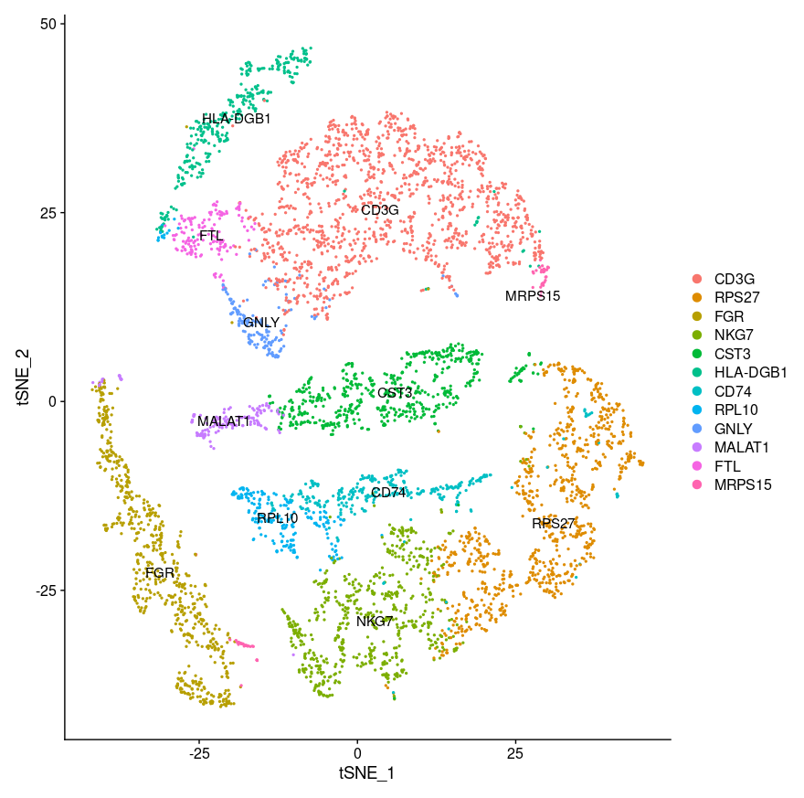
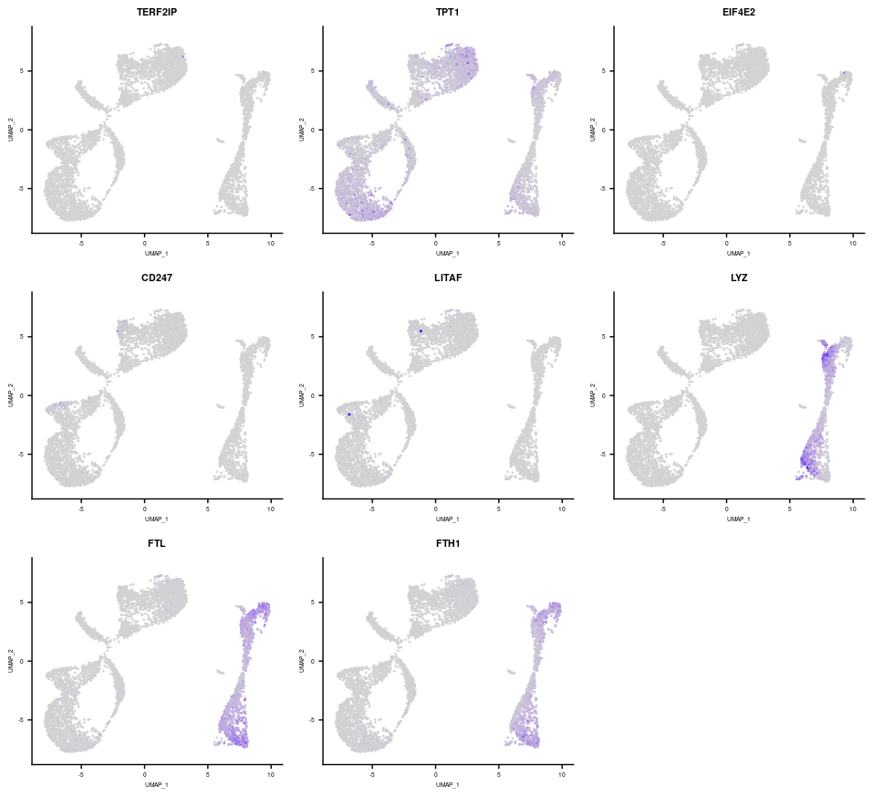
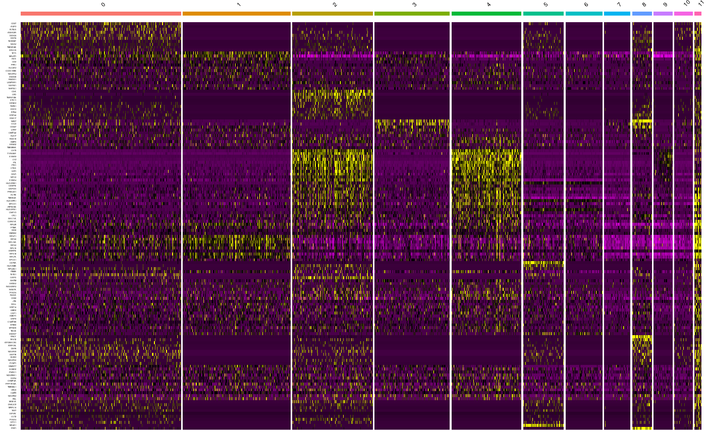
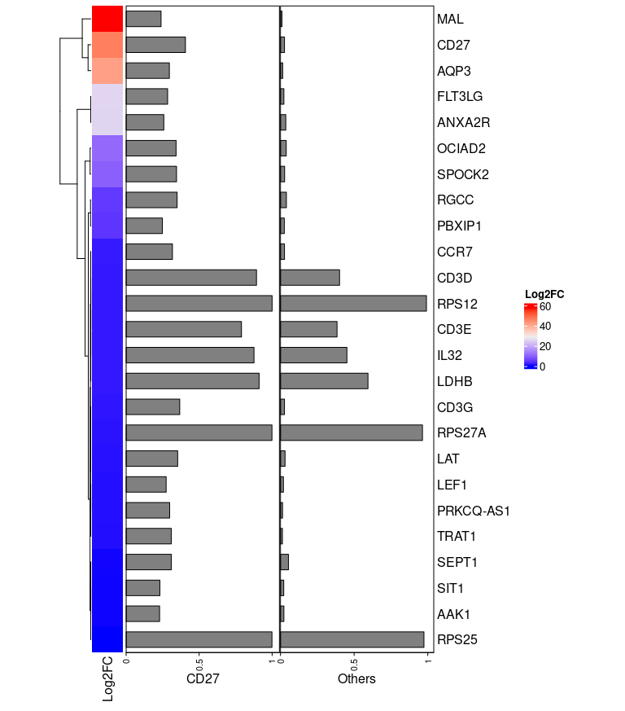
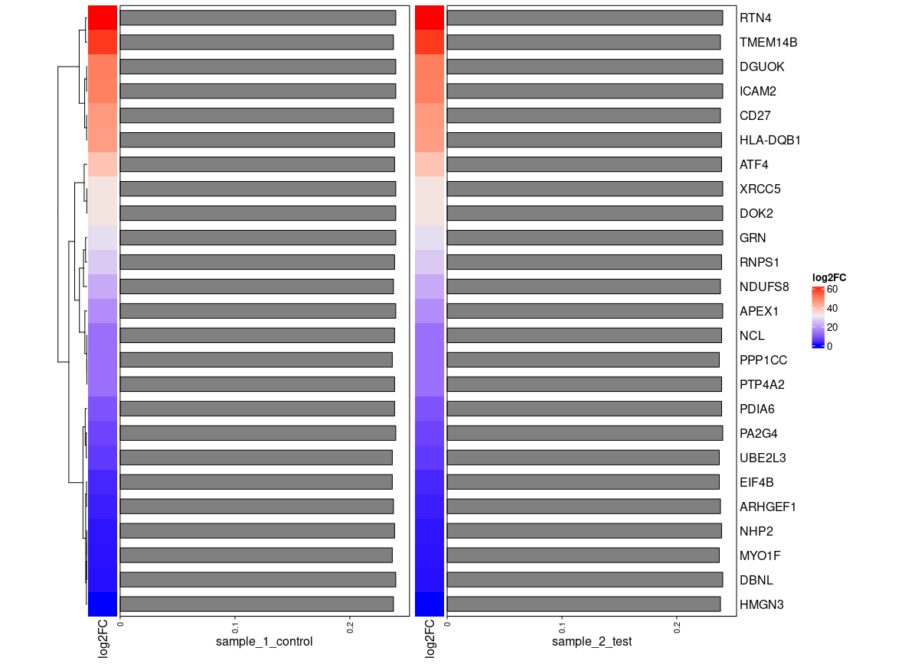

### OS
Any Linux based distro should work. Out test OS is:

Distributor ID: Ubuntu <br/>
Description:    Ubuntu 20.04.2 LTS <br/>
Release: 	20.04 <br/>
Codename:       focal <br/>

`lsb_release -a` on a Ubuntu based system.


### Software and packages


- git

- R version 3.6.1

- Seurat 4.0


# Integrated Single Cell RNA Seq data analysis, clustering and marker selection:

The dataset is collected from the 10X Genomics the Peripheral Blood Mononuclear Cells (PBMC) (https://support.10xgenomics.com/single-cell-gene-expression/datasets/1.1.0/pbmc3k), that contains a total 2700 single cells. The analysis is done by Seurat.
Seurat is a toolkit for analyzing single cell RNA-set data (https://satijalab.org/seurat/).
Seurat can be downloaded using the following link: 

       https://​cloud.r-project.org/​package=Seurat

The single cell sample dataset from 10x genomics should contain following three files:


- barcodes.tsv

- genes.tsv

- matrix.mtx

### Step-1 Setting up:
The first step is to read the 10x Genomics dataset and to create Seurat object. For this, dplyr, Seurat, patchwork libraries and Read10X and CreateSeuratObject functions have been used. The following command lines can be used to download the mentioned libraries in R:

```bash
install.packages("dplyr")
install.packages('Seurat')
install.packages('patchwork')
```
    
- dplyr package is used to data manipulation operations.
- Seurat package is used for single cell RNA-seq data quality control and analysis.
- Patchwork package is used to make simple and effective plot. 

### Step-2 Dataset splitting:
Splitting the single cell RNA seq dataset in two data sets. 
Sample dataset-1 (Sample_1_control) :   The selected min.cells = 350 and selected min.features=250
Sample dataset-2 (Sample_2_test) :   The selected min.cells = 650 and selected min.features=250

- min.cells sets the threshold for genes that are present in at least a specific number of cells.
- Min.features sets thresholds for cells that are presented at least a specific number of genes.

### Step-3 Aligning the two separated dataset:
merge function of R is used to combine the selected datasets by implementing the following command line:


```bash
merged.sc_rna_data <-merge (x=sample_1_control, y=sample_2_test, add.cell.ids=c("sample_1_control","sample_2_test"), project="SCRNA_Data")
```
### Step-4 Generation of quality metrics:
1. Addition of automatically created Seurat metadata for each of the cells to the merged dataset. Stringr library is used. The library is downloaded using the following command line. 
 

2. Calculating Mitochondrial quality control (QC) metrics by using PercentageFeatureSet() function. Because mitochondrial contamination is represented by low quality/dying cells.

<p align="center">
  
</p>
Fig.1 Representation of mitochondrial QC metrics for both dataset (sample_1_control and sample_2_test)in violin plot. The cells are filtered about >15% mitochondrial counts.

3. Adding cell IDs to the metadata.
4. Extracting cell identity and sample information from seurat object in regard to determine the number of cells per cluster per sample

 |  Sample_1  | Sample_2  |      
 |:-----------|:-----------|
|2697         | 2697
4.  Determining the other metrics present in merged dataset (nUMI, nGene, mitoRatio).
    - nUMI= Number of unique molecular identifier.
    - nGene= Number of gene.
    - mitoRatio= Mitochondrial Ratio. 
5. Extracting the UMAP coordinates for each cell and including information about the metrics to plot.
6. Adding cluster label to center of cluster on UMAP.
 

<p align="center">
  
</p>
Fig 2. Representation of nUMI, nGene, mitoRatio in UMAP. Genes with the lowest expression exhibit completely gray shading and genes with the highest expression exhibit purple shading.

### Step-4 Data normalization and standard prepossessing :
Normalization is done to prevent technical noise or bias in scRNA-seq analysis. In order to normalize the count data NormalizeData() function is used. To fit the variance-mean relationship of the merged data loess span parameter (vst method) has been used.

### Step-5 Data cleaning and dimentionality reduction:
1. Scaling integrated data.
2. Identification of features by FindVariableFeatures() finction.
3. Principal Component Analysis (PCA) to find out data variation, similarity and to provide strong patterns in a dataset. Moreover, it is useful for dimensionality reduction. RunPCA() function is used to run PCA for dimentionality reduction.

<p align="center">
  
</p>

Fig 3. UMAP plot for top 10 PCs. 

### Step-6 Computing the nearest neighbors:
FindNeighbors() function is used to calculate nearest neighbor. For scRNA-seq data Siamese Neural Network (SNN) is annotated.


### Step-7 Clustering the cells:
In regard to measure the similarities among genes/transcripts of cells clusters of cells is performed. Clustering is done by FindClusters() function.

     Modularity Optimizer version 1.3.0 by Ludo Waltman and Nees Jan van Eck

     Number of nodes: 5394
     Number of edges: 244934

RunTSNE() function is used to dimentionality reduction in selected features. 

<p align="center">
  
</p>

Fig 4. Representation of t-SNE clustering consist of 12 clusters on 12 different colors.

### Step-8 Finding markers for the cluster and assigning cluster name:
In response to find the specific markers for each cluster FindMarkers() function has been used.

<p align="center">
  
</p>
Fig 5. Representation of t-SNE clustering with specific markers to the particular cluster.

### Step-9 Finding markers for every cluster compared to all remaining cells:
FindAllMarkers() function has been implemented for this purpose.
<p align="center">
  
</p>
Fig 6. Combined feature plot.
<p align="center">
  
</p>
Fig 7. Combined heatmap including 12 features and all of genes

### Step-10: Finding differentially expressed features between the cells

  | gene name | p_val                              | avg_log2FC | pct.1 | pct.2 |     p_val_adj         |
---|:-----------------------------------|:-----------|:------|-------|--------------| 
   | CD27 | 6.609982e-296                      | 46.62      | 0.406 | 0.027 |       1.041072e-292      |
   | CD3G | 9.832141e-259                      | 1.45       | 0.367 | 0.58  |       1.548562e-255       | 
   | TRAT1 | 1.830448e-245                      | 1.01       | 0.309 | 0.013 |          2.882956e-242    |
   | LAT | 4.071668e-231                                   | 0.345      | 0.028 | 11.34 |     6.082189e-229         |
| 

#### Step-10.1 Generation of Heatmap of differentially expressed features between particular cell/marker and all other cells/marker cluster
ComplexHeatmap() library is used for this purpose.

<p align="center">
  
</p>
Fig. 8 Heatmap of differentially expressed features between CD27 marker and all other marker cluster.

<p align="center">
  
</p>
Fig. 9 Heatmap of differentially expressed features betweem sample_1_control and sample_2_test.


